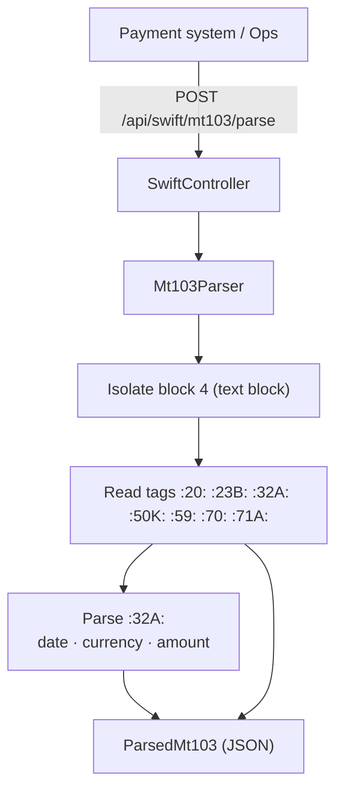
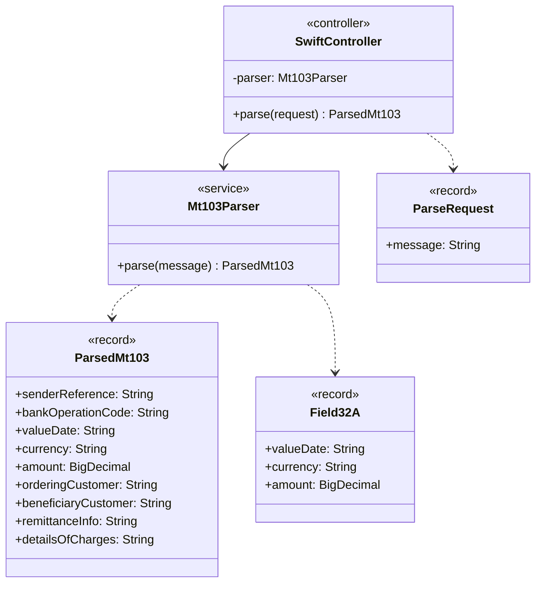

# SWIFT MT103 Parser

Parser microservice for **SWIFT MT103** single customer credit transfer messages. It extracts the key fields into a structured JSON payload.

Built with **Java 17** and **Spring Boot 3**. No external SWIFT library is required; parsing is done with a focused tag reader.

## Architecture



## Supported fields

| Tag | Meaning | Output field |
|-----|---------|--------------|
| `:20:` | Sender's reference | `senderReference` |
| `:23B:` | Bank operation code | `bankOperationCode` |
| `:32A:` | Value date / currency / amount | `valueDate`, `currency`, `amount` |
| `:50K:` / `:50A:` | Ordering customer | `orderingCustomer` |
| `:59:` | Beneficiary customer | `beneficiaryCustomer` |
| `:70:` | Remittance information | `remittanceInfo` |
| `:71A:` | Details of charges | `detailsOfCharges` |

Mandatory tags (`:20:`, `:32A:`, `:59:`) are enforced; a missing one returns `400`.

## Domain model

Class-level view of the main types and how they relate (fields, operations and dependencies).



## Quick start

```bash
./mvnw spring-boot:run      # Linux / macOS
mvnw.cmd spring-boot:run    # Windows
```

Run tests:

```bash
./mvnw test
```

## Example request

```bash
curl -s -X POST http://localhost:8083/api/swift/mt103/parse \
  -H "Content-Type: application/json" \
  -d '{ "message": ":20:REF1234567890\n:23B:CRED\n:32A:260720EUR12345,67\n:50K:/TR000000000000000000000000\nACME EXPORT LTD\n:59:/DE00000000000000000000\nMUELLER GMBH\n:70:INVOICE 2026-42\n:71A:SHA" }'
```

Example response:

```json
{
  "senderReference": "REF1234567890",
  "bankOperationCode": "CRED",
  "valueDate": "2026-07-20",
  "currency": "EUR",
  "amount": 12345.67,
  "orderingCustomer": "/TR000000000000000000000000 ACME EXPORT LTD",
  "beneficiaryCustomer": "/DE00000000000000000000 MUELLER GMBH",
  "remittanceInfo": "INVOICE 2026-42",
  "detailsOfCharges": "SHA"
}
```

## API

| Method | Path | Description |
|--------|------|-------------|
| `POST` | `/api/swift/mt103/parse` | Parse an MT103 message |
| `GET` | `/api/swift/mt103/health` | Health check |

## Design notes

- Accepts either a full SWIFT message (with `{1:}{2:}{4:...-}` blocks) or just the text block tags
- `:32A:` amount uses SWIFT decimal comma; it is normalized to a standard decimal
- Multi-line party blocks are flattened into a single field value

## License

MIT — see [LICENSE](LICENSE).

<!-- docs: maintenance pass 2026-06-02 -->
