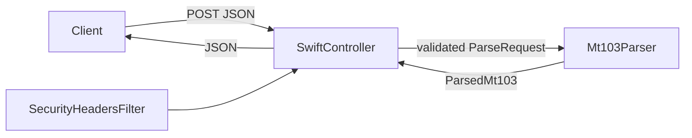

# Architecture

SwiftMt103Parser is a stateless Java 17 and Spring Boot HTTP service.

`SwiftController` owns the `/api/swift/mt103` endpoints. Bean validation rejects blank messages and messages larger than 35,000 characters before parsing. `SecurityHeadersFilter` adds response headers that reduce browser exposure for this JSON API.

`Mt103Parser` isolates block 4 when a SWIFT envelope is supplied, reads tags in order, rejects duplicates, checks `:20:`, `:32A:`, and either `:59:` or `:59A:`, then parses `:32A:` into a date, supported currency, and decimal amount. Multi-line tag values are flattened for the response record.

The service has no database, queue, external SWIFT connection, or persistence layer. Fixtures in `src/test/resources/mt103` exercise supported and rejected message shapes.
