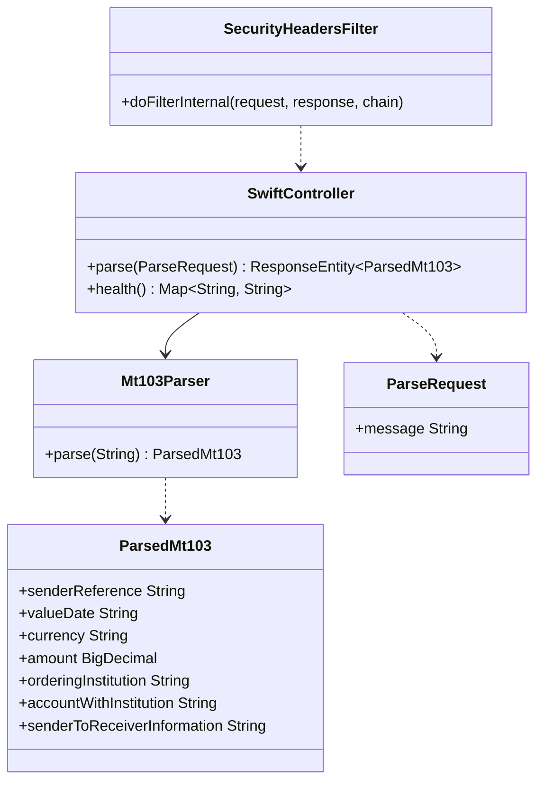
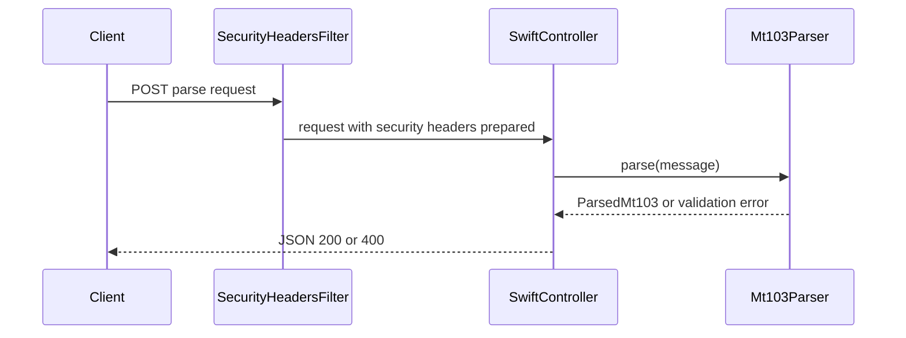

# UML

```mermaid
classDiagram
    class SwiftController {
        +parse(ParseRequest) ResponseEntity~ParsedMt103~
        +health() Map~String, String~
    }
    class Mt103Parser {
        +parse(String) ParsedMt103
    }
    class SecurityHeadersFilter {
        +doFilterInternal(request, response, chain)
    }
    class ParseRequest {
        +message String
    }
    class ParsedMt103 {
        +senderReference String
        +valueDate String
        +currency String
        +amount BigDecimal
        +orderingInstitution String
        +accountWithInstitution String
        +senderToReceiverInformation String
    }
    SwiftController --> Mt103Parser
    SwiftController ..> ParseRequest
    Mt103Parser ..> ParsedMt103
    SecurityHeadersFilter ..> SwiftController
```

```mermaid
sequenceDiagram
    participant C as Client
    participant F as SecurityHeadersFilter
    participant W as SwiftController
    participant P as Mt103Parser
    C->>F: POST parse request
    F->>W: request with security headers prepared
    W->>P: parse(message)
    P-->>W: ParsedMt103 or validation error
    W-->>C: JSON 200 or 400
```
